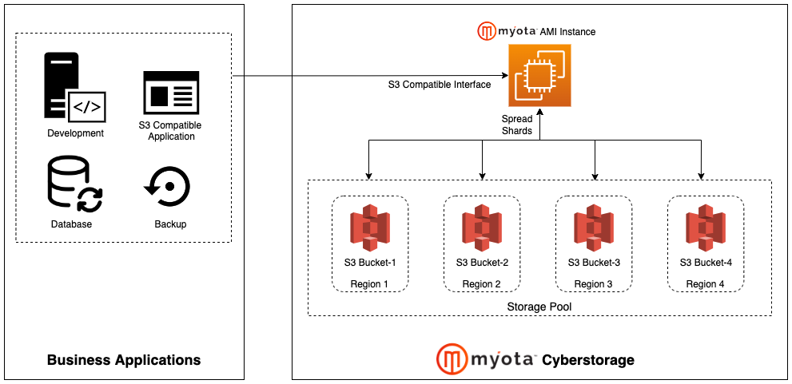

# Myota Cyberstorage

Available in AWS Marketplace. [link](https://aws.amazon.com/marketplace/search/results?searchTerms=myota)

## Myota Cyberstorage Distributes Data into Your Storages

* Zero-trust architecture to secure your storages and data
* Bring your own storage
  * AWS S3
  * Google Cloud Storage
  * Azure Blob Storage
  * S3-compatible on-prem storage
  * You can mix-and-match
* Use Cases
  * Target repository of backup and data archive service
  * Persistent storage of your application
  * Replacing multi-region bucket
  * Storage for Isolated Recovery Environment

## How Myota Works

* Split a file into encrypted chunks
* Encode chunks to shards
* Distribute shards into multiple storages
* The file can be reconstructed only if corresponding shards from different storages are collected

## How to Deploy

* Launch Myota AMI instance
* Configure your storages
* Store data into Myota using S3 interface
* Your data is distributed into the storages in from of shards
* Read data from Myota using S3 interface
* Your data is reconstructed from the shards

## More Information

* [How Myota Works](https://www.myota.io/myota-methodology)
* [AWS Marketplace Deployment Instruction](https://github.com/myotaio/s3c-samples)
* [Python sample code to use Myota S3 interface](https://github.com/myotaio/s3c-samples/tree/main/samples/gallery-demo)
